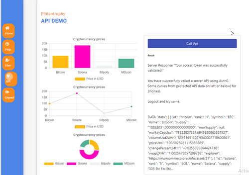

# Philanthropy Proto
   
**WORK IN PROGRESS** 
This is a work in progress by me. In line with the other fortunes in the main Benefacts project it did not get to full fruition.
Partial remit of the prototype was to test technologies listed and these are working.
It does
<li>use Azure & Azure devops for deployment.
<li>use Auth0 for main login and for API login.
<li>use Redux.
<li>have use-ablity features from phones.
<li>have a noddy home , user and help page. Text is in the Ad lorem Ipsum format so site is not data sensitive.  

There are known issues in visually in front end and code layout / other 
but overall it is hopefully useful as a discussion point.   

 [Go to deployed test site on azure](https://ptwebclienttest.azurewebsites.net/)
  From the deployed test site you can either set yourself up with a auth0 userid and password ( verification mail can end up taking a few minutes to arrive and may end up in spam )
or you can use usernoddy22@gmail.com  / <a href="mailto:mylesdolan@gmail.com">send email for password</a>
  
